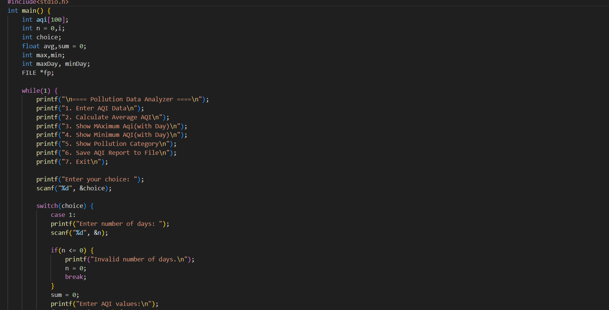

# Pollution Data Analyzer (C)

A powerful command-line tool written in C to analyze Air Quality Index (AQI) data and generate detailed pollution reports.



## 🚀 Features
* Analyzes daily/monthly AQI trends.
* Identifies peak pollution hours.
* Categorizes air quality (Good, Moderate, Unhealthy, etc.).
* Generates a summary report in the console.

## 🛠️ Installation & Usage
1. Clone the repository:
   ```bash
   git clone [https://github.com/rajatpatra30/Pollution-Data-Analyzer-C.git](https://github.com/rajatpatra30/Pollution-Data-Analyzer-C.git)
## compile the code
gcc pollution.c
## Run the application
./analyzer
